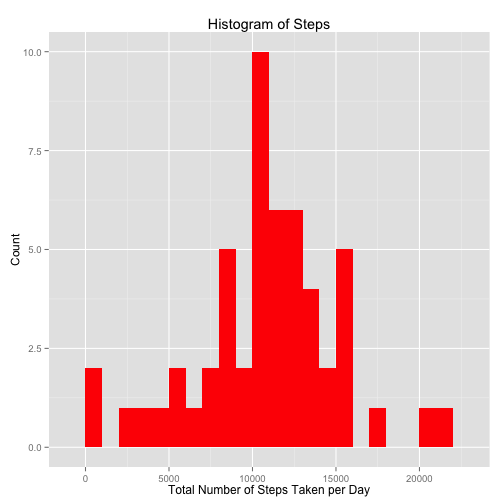
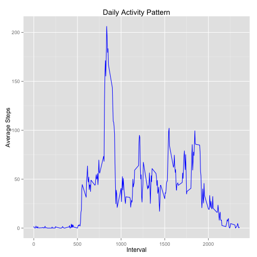
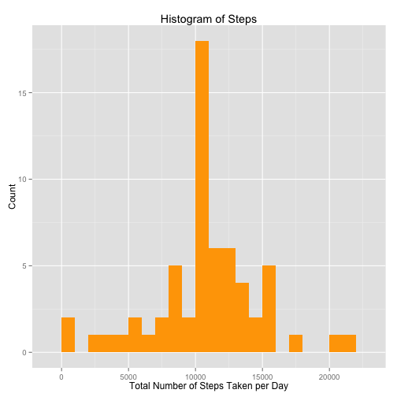
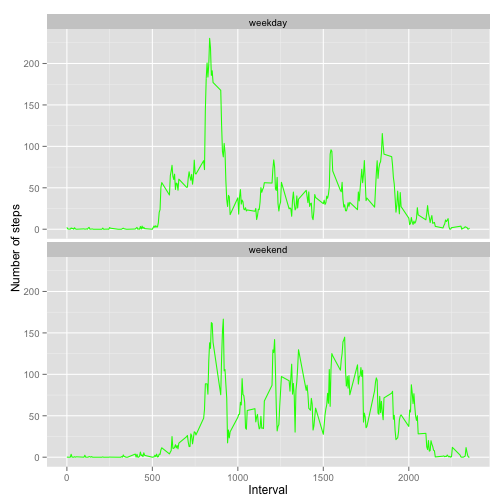

# Peer Assessment 1 - Reproducible Research


It is now possible to collect a large amount of data about personal movement using activity monitoring devices such as a Fitbit, Nike Fuelband, or Jawbone Up. These type of devices are part of the "quantified self" movement -- a group of enthusiasts who take measurements about themselves regularly to improve their health, to find patterns in their behavior, or because they are tech geeks. But these data remain under-utilized both because the raw data are hard to obtain and there is a lack of statistical methods and software for processing and interpreting the data.

This assignment makes use of data from a personal activity monitoring device. This device collects data at 5 minute intervals through out the day. The data consists of two months of data from an anonymous individual collected during the months of October and November, 2012 and include the number of steps taken in 5 minute intervals each day.

## Data


First we will need to set the working directory then download and load the data required for this assignment.

Note: It is assumed that the file activity.csv is in the current working directory. File can be downloaded from [here](https://d396qusza40orc.cloudfront.net/repdata%2Fdata%2Factivity.zip) if necessary. The code below shows how to download the data from the above web link if a local copy does not exist.


```r
setwd("~/Desktop/Coursera/Reproducible Research/PA1/data")
if(!file.exists("data")){
        dir.create("data")
}
fileUrl <- "https://d396qusza40orc.cloudfront.net/repdata%2Fdata%2Factivity.zip"
download.file(fileUrl, destfile = "./data/activity.zip", method = "curl")
```

Load the data from the local drive.


```r
data <- read.csv("./data/activity.csv")
```

```
## Warning in file(file, "rt"): cannot open file './data/activity.csv': No
## such file or directory
```

```
## Error in file(file, "rt"): cannot open the connection
```

## What is mean total number of steps taken per day?

For this part of the assignment, we will calculate the total number of steps taken each day and plot them using a histogram. Then we will report the mean and median of the total number of steps taken each day.


```r
library(ggplot2)
library(stats)
totalSteps <- aggregate(steps ~ date, data, sum)
ggplot(totalSteps, aes(steps)) + geom_histogram(fill = "red", binwidth = 1000) +
 labs(title = "Histogram of Steps", x = "Total Number of Steps Taken per Day", y = "Count")
```

 

```r
mean(totalSteps$steps, na.rm = TRUE)
```

```
## [1] 10766.19
```

```r
median(totalSteps$steps, na.rm = TRUE)
```

```
## [1] 10765
```
The average number of steps is 10766 and the median number of steps is 10765.

## What is the average daily activity pattern?

To answer this question, we will make a time series plot of the 5-minute interval and the average number of steps taken, averaged across all days.


```r
step_int <- aggregate(x = list(steps = data$steps), by = list(interval = data$interval), mean, na.rm=TRUE)
ggplot(step_int, aes(x=interval, y=steps)) + geom_line(color = "blue") +
        labs(title = "Daily Activity Pattern", x = "Interval", y = "Average Steps")
```

 

Determine which 5-minute interval, on average across all the days in the dataset, contains the maximum number of steps?


```r
step_int[which.max(step_int$x),]
```

The 835th interval, on average, contains the maximum number of steps.

## Imputing missing values

First count the number of mising values (NA values)


```r
sum(is.na(data$steps))
```

```
## [1] 2304
```


```r
sum(is.na(data$date))
```

```
## [1] 0
```


```r
sum(is.na(data$interval))
```

```
## [1] 0
```

Replace the missing calues of the steps column with the average number of steps for the same interval.


```r
completedata <- data
for(i in 1:nrow(completedata)){
        if(is.na(completedata$steps[i])){
                fill <- step_int$steps[step_int$interval == completedata$interval[i]];
                completedata$steps[i] <- fill;
        }
}
sum(is.na(completedata$steps))
```

```
## [1] 0
```

Confirm the correct values were imputed into the new dataset


```r
head(data$steps)
```

```
## [1] NA NA NA NA NA NA
```


```r
head(step_int$steps)
```

```
## [1] 1.7169811 0.3396226 0.1320755 0.1509434 0.0754717 2.0943396
```


```r
head(completedata$steps)
```

```
## [1] 1.7169811 0.3396226 0.1320755 0.1509434 0.0754717 2.0943396
```

Create a histogram using the new dataset and report the mean and median number of steps taken per day.


```r
library(ggplot2)
library(stats)
completeSteps <- aggregate(steps ~ date, completedata, sum)
ggplot(completeSteps, aes(steps)) + geom_histogram(fill = "orange", binwidth = 1000) +
 labs(title = "Histogram of Steps", x = "Total Number of Steps Taken per Day", y = "Count")
```

 

```r
mean(completeSteps$steps, na.rm = TRUE)
```

```
## [1] 10766.19
```

```r
median(completeSteps$steps, na.rm = TRUE)
```

```
## [1] 10766.19
```

## Are there differences in activity patterns between weekdays and weekends?

To determine this we need to create a new factor variable in the dataset with two levels – “weekday” and “weekend” indicating whether a given date is a weekday or weekend day. Create a column called "day". For simplicity, fill the column with weekday then rename Saturdays and Sundays as weekend


```r
completedata$day <- "weekday"
completedata$day[weekdays(as.Date(completedata$date)) %in% c("Saturday", "Sunday")] <- "weekend"
table(completedata$day)
```

```
## 
## weekday weekend 
##   12960    4608
```

Average the number of steps per day by day type, weekday or weekend.


```r
average <- aggregate(steps ~ interval + day, data = completedata, mean)
ggplot(average, aes(interval, steps)) + geom_line(color = "green") + 
facet_wrap(~day, nrow = 2, ncol = 1) +
labs(x = "Interval", y = "Number of steps")
```

 


